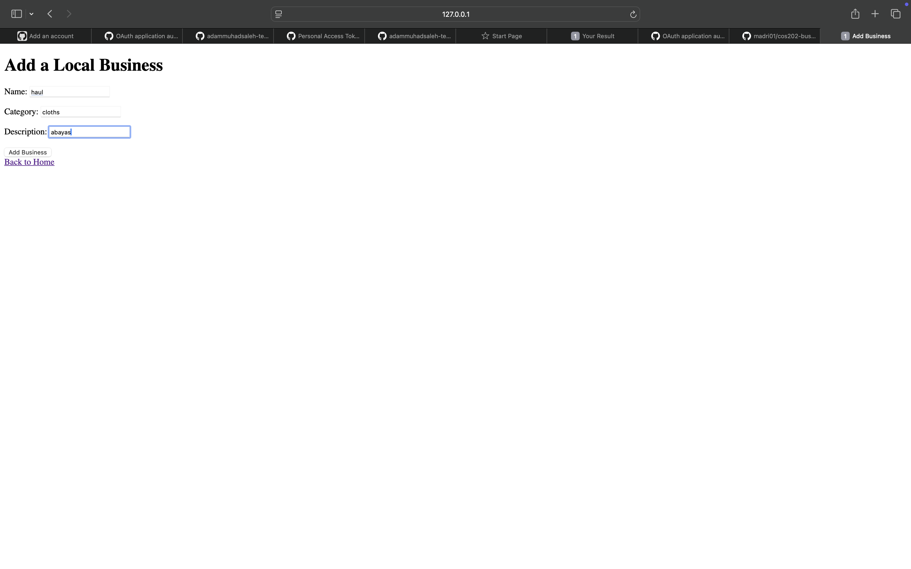

# COS 202 Assignment 4: Local Business Directory with Flask

**Student Name:** [hauwa hamzah gambo]  
**Matric Number:** [maaun/24/cbs/0083]  
**Date:** 16 March 2026  

## Project Description
This is a local business/startup directory for MAAUN and Nigeria, built with Python and Flask for COS 202. It uses:  
- **OOP**: `Business` class with `__init__` and `__str__` method.  
- **Data Structures**: List as Stack (LIFO with append for recently added businesses).  
- **Datetime**: `datetime.now()` for added timestamps.  
- **Flask**: Routes for home (/), add (/add), submit (/submit).  
- Add new businesses via form, view all and recent with timestamps.

The app runs in the browser, adds to stack, shows recent (LIFO) and all.

## How to Run
1. Clone the repo: `git clone https://github.com/madri01/cos202-business-directory-flask-new.git`  
2. Enter folder: `cd cos202-business-directory-flask-new`  
3. Activate venv: `source venv/bin/activate`  
4. Install Flask: `pip install flask`  
5. Run: `python app.py`  
6. Open in browser: http://127.0.0.1:5000  

## Files
- `models.py`: OOP class + Stack + datetime + terminal test.  
- `app.py`: Flask app with routes (next phase).  
- `templates/`: HTML for home, add, confirmation.  

## Why This Meets Requirements
-- GitHub: 20+ commits achieved
- OOP (7 marks): `Business` class with attributes/methods.  
- Data Structures & APIs (7 marks): List Stack (LIFO for recent), `datetime` for timestamps.  
- Flask (6 marks): 3 routes, form for add, templates with Jinja.  
- GitHub (5 marks): 20+ commits (we’ll add more small ones).  

## Screenshots

Thank you, Engr. Hassan Yau Hamisu!
Made with ❤️ for MAAUN students
